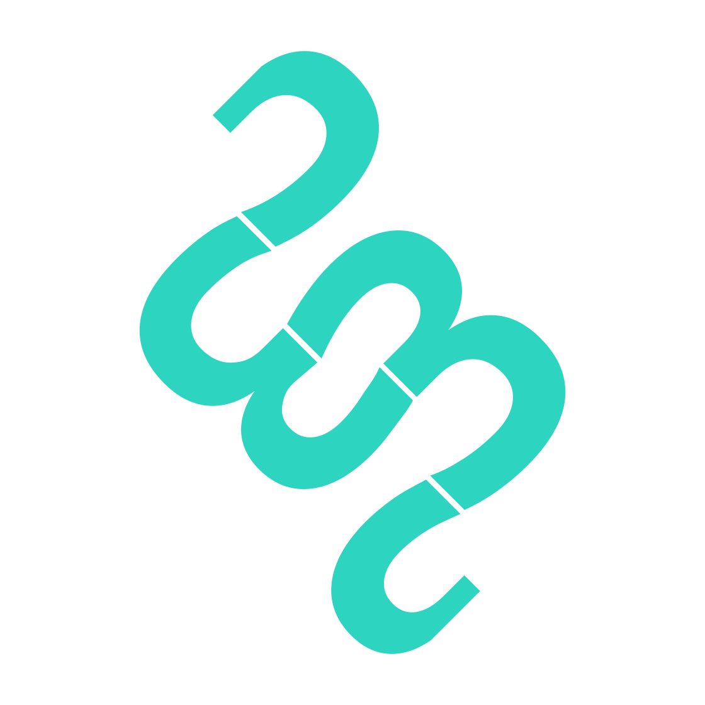
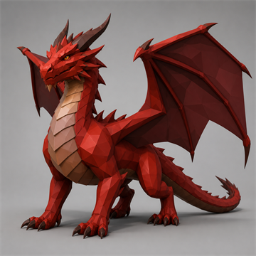
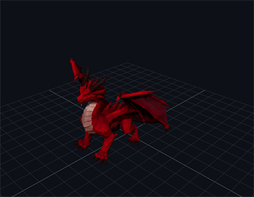
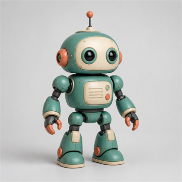
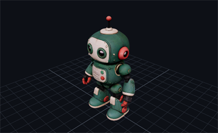

<h1>
  
  Triastasis
</h1>

**A local workspace for turning images into textured 3D assets.**

Triastasis generates a 3D model from a single image, lets you inspect and
correct the result, preserves its generation history, and exports a portable
GLB. Generation runs locally through a native C++/GGML implementation of
Microsoft TRELLIS.2. No Python environment, hosted generation service, or
ComfyUI workflow is required at runtime.

Triastasis is currently alpha software.

## Highlights

- Local image-to-3D generation on CUDA, Vulkan, or ROCm.
- Verified, resumable model downloads with hardware-aware recommendations.
- Quality presets, advanced generation controls, and seed sweeps.
- Textured, clay, wireframe, topology, UV, normal, and PBR channel inspection.
- Practical non-destructive corrections for static models.
- A searchable local asset library with favorites and version lineage.
- Reproducible `.triastasis.json` manifests and interrupted-job recovery.
- A loopback-only queued automation API for local tools and agents.
- An optional Codex workflow for generating, inspecting, and integrating static game assets.

## Examples

These are direct source-to-result pairs from local generations at 1024
resolution with seed 42. The after images are renders of the exported GLBs.

| Example | Before: source image | After: generated GLB |
| --- | --- | --- |
| Dragon | [](./docs/images/examples/dragon-before.png) | [](./docs/images/examples/dragon-after.png) |
| Robot | [](./docs/images/examples/robot-before.png) | [](./docs/images/examples/robot-after.png) |
| Rocket | [](./docs/images/examples/rocket-before.png) | [](./docs/images/examples/rocket-after.png) |

## Quick start

The current alpha release supports Windows x64. Linux support is still work in
progress and is not part of the supported release yet. Download and run
`triastasis-windows-x64-setup.exe` from the release page. On first launch, the
app detects the GPU, installs a verified native runtime, and guides you through
credits, model terms, storage, and a verified model-bundle download. No terminal
or PowerShell command is required.

See [Getting started](docs/getting-started.md) for portable installations,
storage locations, backend selection, installer options, and troubleshooting.

## Desktop workspace

Triastasis is a standalone desktop app built with [Tauri](https://tauri.app)
for anyone who wants image-to-3D without managing a Python environment. The
Windows installer adds the desktop app, and first-run onboarding installs the
matching native runtime. On first launch, onboarding explains the project
credits and model terms, recommends a model bundle for the detected hardware, and provides a verified, resumable
in-app download.

**Using it:**

1. **Complete onboarding** by installing the recommended runtime, reviewing
   Credits, choosing model storage, and activating a curated or custom model
   bundle.
2. **Add an image** by dropping it onto the source area, browsing for one, or
   pasting from the clipboard.
3. **Choose a preset.** Medium is the recommended default, Low is faster, and
   High uses the stable 1024 path with denser geometry and textures. The 1536
   geometry option remains experimental under Advanced settings.
4. **Generate 3D.** A live stage line shows progress, and additional requests can
   be added to the queue.
5. **Inspect** the result in View using textured, clay, wireframe, topology, UV,
   normal, and PBR modes.
6. **Export or reuse** the model from Assets or Library. Triastasis preserves the
   source image, settings, versions, and lineage across restarts.

Settings controls model storage, the output folder, GPU index, runtime port, and
server diagnostics. See [`docs/getting-started.md`](docs/getting-started.md) for
the full onboarding flow, portable setup, storage locations, and troubleshooting.
Browser-only development is documented in [`app/README.md`](app/README.md).

### Model download verification and recovery

Triastasis downloads curated model bundles from URLs pinned to an exact Hugging Face
repository revision. Every file is checked against its expected size and SHA-256 from
the model catalog before it is installed.

If a catalog hash is stale, Triastasis performs a second, independent check against
the LFS SHA-256 published by Hugging Face for the same repository, revision, path,
and size. A file is accepted only when its downloaded SHA-256 matches one of these
trusted records. It is never accepted merely because the download completed or its
filename looks correct.

When neither check can verify a file, the app keeps the partial download and shows
the source URL, expected hash, downloaded hash, and upstream verification result.
**Try resume again** verifies reusable files before downloading anything missing.
If recovery continues to fail, **Delete incomplete files** removes only that managed
incomplete bundle. Triastasis does not run an unverified model bundle.

### Models from other sources

The desktop app provides **Use your own model files** during onboarding and
**Add custom model folder** in Settings. Advanced users can download a compatible
GGUF set from any source, select its local directory, accept the explicit warning,
and use the files at their own risk. Triastasis does not establish the publisher,
require published checksums, or guarantee that a custom bundle is safe, compatible,
complete, or supported.

Custom sources must always be labelled **Unverified custom bundle** and must never be
presented as curated or publisher-verified. The app performs only a minimum
operational check that the selected directory contains a readable GGUF file. A custom
bundle that the server cannot load reports the server error without implying that
Triastasis supports that bundle.

Custom model files remain in their original user-owned directory. Triastasis does not
copy, rename, overwrite, or delete them. Forgetting a custom folder removes only the
saved reference. These boundaries protect the user's computer, not the provenance or
quality of the models they chose.

### Manage 3D assets with Codex

The repository includes the project skill
[`$triastasis-assets`](.agents/skills/triastasis-assets/SKILL.md).
It manages static 3D assets across generation, Blender inspection, portable
export, safe recursive library import, recovery, and integration into Three.js,
Godot, Unity, Unreal, or other game projects. It does not claim that generated
assets are rigged, skinned, or animation-ready.

Open this repository in Codex, start Triastasis, and ask:

```text
Use $triastasis-assets to turn this reference image into an inspected, portable 3D asset and integrate it into my game.
```

For generation, the skill defaults to one fast 512 result and applies a static-asset quality
gate before integration. Its scripts use the loopback-only queued automation API
documented in [`app/AUTOMATION.md`](app/AUTOMATION.md).

The sections below document the **CLI and HTTP server** directly, for advanced and
scripted use.

## Native runtime

Triastasis includes a modified C++/GGML runtime derived from
[Piotr Wilkin's `trellis.cpp`](https://github.com/pwilkin/trellis.cpp). The
desktop app supervises its resident `trellis-server`; advanced users can also
use the CLI and HTTP server directly.

### CLI usage

The default is the **1024 cascade** (LR `flow_512` → upsample → HR `flow_1024` →
res-1024 decode, sharper geometry); `--res 512` selects the lighter res-512 path.
All behavior is driven by CLI flags — run `trellis-cli --help` for the full list.
The most useful ones:

| flag                               | effect                                                                                                                                                                                                                            |
| ---------------------------------- | --------------------------------------------------------------------------------------------------------------------------------------------------------------------------------------------------------------------------------- |
| `--res 512\|1024\|1536`            | geometry resolution (512 = light path, no cascade)                                                                                                                                                                                |
| `--bg-removal threshold\|birefnet` | default **auto**: pre-matted images keep their alpha, otherwise the BiRefNet matte (~13s on GPU). The plain white-bg keyer cuts specular highlights out of the alpha — the flow then generates holes there — so it is opt-in only |
| `--no-texture`                     | geometry only                                                                                                                                                                                                                     |
| `--decim GRID`                     | legacy cluster-grid decimation (default: quadric simplify to 300K faces @1024 / 150K @512; `0` = keep the full-res mesh)                                                                                                          |
| `--atlas PX`                       | UV atlas size (default 2048 @1024 / 1024 @512)                                                                                                                                                                                    |
| `--box-uv`                         | voxel-native 6-way box projection instead of the default xatlas unwrap (O(faces), faster, looser packing)                                                                                                                         |
| `--seed N`                         | RNG seed                                                                                                                                                                                                                          |
| `--require-gpu`                    | fail instead of falling back to the (very slow, RAM-hungry) CPU path                                                                                                                                                              |

The native postprocess in `src/remesh_dc.cpp`, `src/uv_bake.cpp`, and
`src/mesh_glb.cpp` follows the reference pipeline operation order: the raw
dual-grid mesh is welded and hole-filled, **remeshed with narrow-band UDF dual
contouring** into a single clean manifold, quadric-simplified to the face budget,
coarse-clustered with the reference's bottom-up normal-cone merge, unwrapped with
stock xatlas per cluster and packed at auto resolution (UVs normalized to fill the
full atlas), shaded per texel by trilinear sampling of the voxel PBR volume (with
BVH closest-point snap onto the original surface), gutter-filled with a Telea
inpaint port, and exported as a GLB with smooth normals and **lossy-WebP textures**
(`EXT_texture_webp`; PNG fallback when built with `-DTRELLIS_WEBP=OFF`). Output
quality is at parity with the reference CUDA postprocess on identical inputs.

`TRELLIS_DBG_*` environment variables toggle developer debug logging only; no
behavior-driving environment variables remain — use the flags above.

### trellis-server

`trellis-server` keeps the process resident (no Vulkan re-init per request) and exposes:

```
GET  /health     -> "ok"
POST /generate      multipart/form-data with an "image" file part; optional text
                    fields "seed", "resolution" (512/1024/1536), "bg_removal"
                    (threshold|birefnet). Returns model/gltf-binary.
```

Launch-time flags (including `--res`) set the per-request defaults; each request can
override them with its own fields.

### Pipeline

```
text prompt
  │  stable-diffusion.cpp (Z-Image)              [external binary]
  ▼
RGB image
  │  BiRefNet / RMBG  (background removal)        [GGML]   → RGBA cutout
  ▼
DINOv3 ViT-L/16 feature extractor                [GGML]   → patch tokens [N,1024]
  │  (image conditioning, + null cond for CFG)
  ▼
① Sparse-Structure flow DiT (1.3B, dense 16³)    [GGML]
  │  → 8-ch 16³ latent → SS conv3d decoder → 64³ occupancy → active voxels
  ▼
② Shape-SLAT flow DiT (1.3B, sparse)             [GGML]   → 32-ch latent / active voxel
  │  → FlexiDualGrid shape decoder (sparse ConvNeXt) → dual grid → FlexiCubes mesh
  ▼
③ Texture-SLAT flow DiT (1.3B, sparse)           [GGML]   → 32-ch latent / active voxel
  │  → Sparse U-Net tex decoder (6-ch PBR per voxel)
  ▼
textured mesh
  │  weld → fill → narrow-band DC remesh → QEM edge-collapse decimate → cluster + xatlas →
  │  trilinear PBR bake (BVH snap) → Telea inpaint    [decimate: CPU / CUDA / HIP / Vulkan]
  ▼
UV-textured GLB (WebP PBR textures)
```

The decimation is a faithful port of the reference's CuMesh QEM edge-collapse simplifier
(Garland-Heckbert quadrics + a skinny-triangle shape metric + flip rejection + boundary
weighting), replacing an off-the-shelf simplifier that produced a fragmented, non-adaptive
mesh. The result matches the reference's adaptive triangulation — a single watertight
component with reference-level surface smoothness. It runs on the GPU (CUDA, ROCm/HIP, or a
Vulkan compute shader) behind one dispatch, with an automatic CPU fallback.

All three flow stages use a `FlowEulerGuidanceIntervalSampler` (rectified-flow Euler,
12 steps, classifier-free guidance with a guidance interval + rescale). Optional
512→1024 cascade for higher resolution.

The 1024 cascade runs on a 16 GB card thanks to **FlashAttention with padded K/V**
(`src/dit.cpp::sdpa`): the manual softmax needed a single ~18 GB score-matrix alloc at
the sparse-structure stage, and at the HR token count (≈53k) ggml's tiled FA NaN'd on
the unpadded last key-tile — zero-padding K/V to a 256 multiple + BF16 fixes both.
f16 compute is the default and matches torch (`--f32` forces f32; `--no-fa` restores
the plain-softmax path for A/B testing).

Every neural component is validated against PyTorch (the `trellis-test-*` binaries +
`tools/ref_*.py`): SS sampler matches torch to rel 4.3e-3 (exact voxel match), DiT
2.8e-3, DINOv3 1.8e-2, sparse conv 1e-3, BiRefNet 4e-4, C2S exact.

### Models

**Pre-built GGUFs:** [`ilintar/trellis2-gguf`](https://huggingface.co/ilintar/trellis2-gguf) —
download the full set and point `trellis-cli` / `trellis-server` (`--models DIR`) at that
folder. To convert source checkpoints yourself, use `tools/convert.py`; use
`tools/quantize_gguf.py` to create quantized variants.

| role            | source                                               | notes                                            |
| --------------- | ---------------------------------------------------- | ------------------------------------------------ |
| SS flow DiT     | `microsoft/TRELLIS.2-4B` `ss_flow_img_dit_1_3B_64`   | 1.3B, bf16                                       |
| Shape SLAT flow | `…/slat_flow_img2shape_dit_1_3B_{512,1024}`          | 1.3B, bf16; `_1024` drives the cascade's HR pass |
| Tex SLAT flow   | `…/slat_flow_imgshape2tex_dit_1_3B_{512,1024}`       | 1.3B, bf16; `_1024` drives the cascade's HR pass |
| Shape decoder   | `…/shape_dec_next_dc_f16c32`                         | FlexiDualGrid VAE                                |
| Tex decoder     | `…/tex_dec_next_dc_f16c32`                           | Sparse U-Net VAE, 6-ch                           |
| SS decoder      | `microsoft/TRELLIS-image-large` `ss_dec_conv3d_16l8` | reused from v1                                   |
| Image cond      | `timm/vit_large_patch16_dinov3.lvd1689m`             | ungated mirror of DINOv3 ViT-L (same weights)    |
| BG removal      | `ZhengPeng7/BiRefNet`                                | ungated BiRefNet (RMBG-2.0 substitute)           |

The two helper models are HF-gated upstream; the ungated equivalents above avoid needing
a token.

### Tools

| tool                                         | purpose                                                                                                                                                    |
| -------------------------------------------- | ---------------------------------------------------------------------------------------------------------------------------------------------------------- |
| `post-replay <dump.bin> <out.glb>`           | re-run the whole postprocess from a `TRELLIS_DUMP_POST` dump in seconds (flags: `--no-remesh`, `--band`, `--no-snap`, `--box-uv`, `--faces`, `--atlas`, …) |
| `tools/glb_metrics.py`                       | CPU geometry/UV/material metrics (components, boundary edges, winding, texel density, doubleSided/WebP flags) for native-runtime-to-reference GLB comparison         |
| `tools/render_glb.py` / `render_glb_fast.py` | quick multi-view flat renders                                                                                                                              |

### Building

GGML is vendored in `thirdparty/ggml`. Pick a backend:

```
cmake -B build -G Ninja -DCMAKE_BUILD_TYPE=Release -DGGML_VULKAN=ON   # Vulkan
cmake -B build -G Ninja -DCMAKE_BUILD_TYPE=Release -DGGML_CUDA=ON    # CUDA
cmake -B build -G Ninja -DCMAKE_BUILD_TYPE=Release -DGGML_HIP=ON     # ROCm
cmake --build build -j
```

See `.github/workflows/release.yml` for the exact flags the release binaries use
(GPU target lists, `-DGGML_OPENMP=OFF` on Windows). Releases also include a
`cuda12` variant built with CUDA 12.9 for Pascal/Volta GPUs (compute capability
6.0/6.1/7.0); the standalone installers select it automatically for devices such
as the Tesla P100.

## Repository layout

```text
app/            Triastasis desktop application and Tauri host
install/        Windows setup and work-in-progress Linux setup scripts
src/            Modified C++/GGML native runtime derived from trellis.cpp
include/        Native runtime public headers
tools/          Runtime conversion, validation, rendering, and inspection tools
docs/           User documentation, manifests, and native runtime specifications
.agents/        Optional Codex project workflow
.github/        Release workflow, security links, and issue templates
thirdparty/     Vendored or referenced native dependencies and license texts
```

## Open-source lineage and license

Triastasis is an independent downstream project based on
[Piotr Wilkin's `trellis.cpp` and Trellis Studio](https://github.com/pwilkin/trellis.cpp).
That project ports Microsoft's
[TRELLIS.2](https://github.com/microsoft/TRELLIS) image-to-3D pipeline to a
native C++/GGML runtime. Triastasis retains and modifies that runtime while
developing its desktop workspace, model management, asset library, editing,
recovery, manifests, and automation around it.

Triastasis is not affiliated with or endorsed by Microsoft.

The software in this repository remains available under the MIT License. Keep the root [`LICENSE`](LICENSE) file and its original copyright notice with copies or substantial portions of the software. Modifications and new contributions can be documented without removing upstream attribution.

Bundled dependencies and separately downloaded model files have their own notices and terms. See [`THIRD_PARTY_NOTICES.md`](THIRD_PARTY_NOTICES.md), especially the separate licensing note for installer-downloaded GGUF model files.
