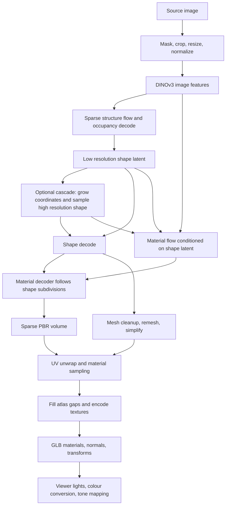

# TRELLIS.2 material appearance investigation

For current follow-ups and experiment status, use the
[research backlog](research-backlog.md).

Research snapshot: 2026-09-12. Branch: `research/trellis-material-diagnostics`.
This step researches upstream behavior and adds observations. It does not change
generation parameters, material values, sampling decisions, or viewer lighting.
No improvement in fidelity has been measured on representative assets yet.

## Findings from upstream

Related defects have been reported in both implementations. They do not establish
the cause of Triastasis's remaining darkness.

| Evidence | What was reported or explained | What it establishes |
| --- | --- | --- |
| [TRELLIS.2 #162](https://github.com/microsoft/TRELLIS.2/issues/162) | Black and reflective spots on a light subject, with otherwise reasonable geometry. No comments at review. | A close symptom match exists in the Python ecosystem; it is an unresolved user report, not a confirmed diagnosis or fix. |
| [TRELLIS.2 #43, collaborator response](https://github.com/microsoft/TRELLIS.2/issues/43#issuecomment-3689810105) | Jeffrey Xiang explains the ambiguity between estimated material properties and environment lighting. Different lighting can change appearance. | Reference output need not reproduce source-image colours under arbitrary lighting. This does not explain every black patch. |
| [trellis.cpp #1](https://github.com/pwilkin/trellis.cpp/issues/1) | Early exports had pixelated appearance, holes, and weaker metallic appearance. The discussion reports subsequent improvement. | The native port had multiple separable quality problems. A closed issue is not proof that every input is now correct. |
| [trellis.cpp release history](https://github.com/pwilkin/trellis.cpp/releases) | v0.4.x describes welded shading normals, postprocessing corrections, and replacing threshold background removal with BiRefNet by default when available. | Several historical fixes already exist locally; repeating them is not a new improvement. |
| [trellis.cpp #22, maintainer response](https://github.com/pwilkin/trellis.cpp/issues/22#issuecomment-5064256215) | The maintainer also observed inputs failing particularly at 1024 while working at 512. | Resolution-dependent failures deserve controlled comparisons. This report concerns reconstruction more broadly, not exclusively material darkness. |
| [TRELLIS.2 #33](https://github.com/microsoft/TRELLIS.2/issues/33) | A user sees no benefit from a 4K atlas over 2K; no response at review. | No official guarantee that a larger atlas improves fidelity. |
| [TRELLIS.2 #52](https://github.com/microsoft/TRELLIS.2/issues/52), [#71](https://github.com/microsoft/TRELLIS.2/issues/71) | Questions about weaker texture guidance and distorted/blurry texturing with custom settings; no replies at review. | These are questions and observations, not validated recommendations to increase guidance or steps. |

The review covered all issues/PR entries returned in trellis.cpp's first 100-item
page and both 100-item TRELLIS.2 pages, then fetched the relevant discussions.
Public source snapshots were read directly; nothing was merged or cherry-picked.
The evidence search did not find a confirmed universal dark-material fix.

## Source versions and comparison boundary

- Triastasis starting commit: `f5c133b` (clean working tree before this work).
- [trellis.cpp inspected commit](https://github.com/pwilkin/trellis.cpp/tree/2516c48b677050c570f47eba2e68dc8a5bc918b0):
  `2516c48b677050c570f47eba2e68dc8a5bc918b0`.
- [Microsoft reference inspected commit](https://github.com/microsoft/TRELLIS.2/tree/75fbf0183001ed9876c8dbb35de6b68552ee08bd):
  `75fbf0183001ed9876c8dbb35de6b68552ee08bd`.

Before instrumentation, local `src/uv_bake.cpp` matched the inspected upstream
file. The orchestration comparison found existing Triastasis progress callbacks,
export controls, and upstream's additional external postprocessing dump path;
the material-resolution mitigation was already present. Local export already
welded shading normals by position and used the expected material channels.

The inherited [native-port analysis](archive/native-port/27-reference-postprocess.md)
and [divergence matrix](archive/native-port/28-divergence-matrix.md) are useful
historical experiments. Their old benchmark numbers and resolved hypotheses
must not be presented as measurements of this branch or the user's assets.

## What the model represents

TRELLIS.2 uses O-Voxel, a sparse spatial representation carrying geometry and
material attributes. Its native 3D VAE compresses this into structured latents;
flow models generate those latents. A latent token is a learned vector at an
active spatial location, not a triangle or a texture pixel. The representation
can express open surfaces and internal structures; later cleanup can impose
additional restrictions. [Microsoft project description](https://microsoft.github.io/TRELLIS.2/),
[paper abstract](https://arxiv.org/abs/2512.14692).

The following is a code trace of Triastasis's current implementation, cross-checked
against the reference. It distinguishes the trained model from the exported mesh
and its final display.

### 1. Input preparation and image conditioning

`src/preprocess.cpp` chooses existing alpha or a background-removal result,
finds the foreground using alpha above 0.8, crops a square with a 10% margin,
premultiplies colour by alpha, resizes, and applies RGB normalization. The
threshold fallback treats sufficiently white pixels as background. An incorrect
mask can erase highlights before any geometry or material generation happens.

`src/dinov3.cpp` encodes the prepared image into features used by the flows.
The cascade uses conditioning at 512 and 1024. These are image resolutions,
not output texture resolutions. Compare the actual cutout, not just the original
image, when comparing implementations.

The reference preprocessing differs in crop margin and its alpha-presence rule.
These differences can change conditioning even with the same image filename.
[Pinned reference preprocessing](https://github.com/microsoft/TRELLIS.2/blob/75fbf0183001ed9876c8dbb35de6b68552ee08bd/trellis2/pipelines/trellis2_image_to_3d.py#L134-L175).

### 2. Sparse structure and the flow sampler

`src/trellis_cli.cpp` first samples an eight-channel dense latent on a 16-cube
grid. `src/ss_decoder.cpp` decodes occupancy logits; active locations are pooled
into a 32-cube grid for the low-resolution shape stage. This establishes where
shape tokens exist, not the finished surface.

`src/flow_runner.cpp` evolves noise using predicted velocity and an Euler update:
`x_next = x - (t - t_next) * predicted_velocity`. A warped time schedule controls
where the finite set of steps lies. Classifier-free guidance combines conditioned
and unconditioned predictions within a selected time interval; guidance rescaling
adjusts prediction spread. Steps and forward calls therefore differ.

Locally there are 12 steps per flow. Sparse structure uses configurable guidance
(default 7.5), rescale 0.7 and time rescale 5. Shape defaults to 7.5, 0.5 and 3.
Material flow uses guidance 1, rescale 0 and time rescale 3. Stronger shape guidance
must not be assumed appropriate for materials. Numerical guards can clamp a
guidance ratio or replace nonfinite velocities; the new logs count these events.
[Reference Euler implementation](https://github.com/microsoft/TRELLIS.2/blob/75fbf0183001ed9876c8dbb35de6b68552ee08bd/trellis2/pipelines/samplers/flow_euler.py).

### 3. Shape latents and the cascade

Each active location receives a 32-channel shape latent. Per-channel training
mean and standard deviation convert normalized flow output into decoder input.
The 512 path decodes this directly. The cascade first grows low-resolution
coordinates, quantizes them onto a higher grid, then samples a new high-resolution
latent. It is not merely subdividing a finished mesh.

The requested high resolution can decrease in 128-unit steps when the token
budget is exceeded, with a floor at 1024. The floor can accept a token count above
the nominal budget. Logging both requested and accepted resolution is necessary.
Changing resolution and keeping the seed does not continue an identical latent.

### 4. Shape decode and mesh extraction

`src/shape_decoder.cpp` grows a sparse hierarchy through four subdivision stages.
The seven-channel geometry head contains three vertex-offset values, three
edge-intersection decisions, and a splitting weight. `src/dual_grid.cpp` converts
offsets into positions, tests edge intersections, gathers neighbouring cells,
and triangulates the resulting quads. Shape subdivision masks are retained for
the material decoder.

This separates neural surface information from later cleanup. A good silhouette
does not establish correct materials; a bad material render does not establish
that these geometry fields are wrong.

### 5. Material flow and decode

The material flow consumes image features and the normalized shape latent,
concatenated with a 32-channel material-noise state. Its output is denormalized
with separate material statistics. The material decoder follows the shape's
subdivision masks so attributes correspond to the intended sparse locations.
It produces six values per voxel: base RGB, metallic, roughness and alpha.
The runtime maps decoder values with `0.5*x + 0.5` and clamps to `[0,1]`.

The new measurements observe values before and after clamping. This exposes
saturation and nonfinite values that final 8-bit images alone cannot explain.
The material is generated in 3D; it is not simply the input photograph projected
onto the front of the mesh.

### 6. Material resolution is independent of atlas size

The native auto path switches material generation to 512 when cascade geometry
has more than nine million decoded voxels. It reuses the low-resolution shape
latent and decodes a matching material guide. Upstream code comments attribute
this to a dark, incoherent outer voxel layer in dense high-resolution decodes,
including an observation in the reference decoder. That is inherited evidence,
not an experiment rerun in this task.

The geometry can remain at 1024 while its material volume is 512 and its atlas
is 4096 pixels. Those numbers measure different things. More atlas pixels cannot
recover details missing from the generated material volume.
[Pinned native orchestration](https://github.com/pwilkin/trellis.cpp/blob/2516c48b677050c570f47eba2e68dc8a5bc918b0/src/trellis_cli.cpp).

### 7. Mesh cleanup, UVs and sampling

Locally, the textured branch fills small holes, welds vertices, remeshes an offset
surface, simplifies it, and removes small components. A BVH over the earlier
surface supports remeshing and material sampling. Automatic remesh band scales
with geometry resolution. A geometry-only output bypasses much of this branch
and is not a controlled comparison of material on the same final geometry.

UVs assign mesh surface positions to a 2D atlas. The runtime uses xatlas, with a
planar-chart fallback; box projection is another option. A rasterized texel maps
back to a 3D point, from which the sparse material field is sampled.

**A concrete divergence:** the reference projects all valid atlas positions onto
the original surface before sampling. Native `VoxSampler::sample` first tries
trilinear sampling at the current position, then bounded BVH projection if that
fails, then a nearby voxel-shell average. Its trilinear implementation renormalizes
available corner weights. The newly logged direct/projected/shell/missing counts
show how often each route is used; they do not determine whether a successful
sample came from the correct material layer. An always-project comparison is a
later controlled experiment, not implemented here.
[Pinned reference bake](https://github.com/microsoft/TRELLIS.2/blob/75fbf0183001ed9876c8dbb35de6b68552ee08bd/o-voxel/o_voxel/postprocess.py#L230-L312),
[pinned native sampler](https://github.com/pwilkin/trellis.cpp/blob/2516c48b677050c570f47eba2e68dc8a5bc918b0/src/uv_bake.cpp#L27-L95).

### 8. Filling, encoding and GLB materials

Native xatlas baking fills unwritten texels with Telea inpainting; the alternative
UV paths dilate nearby colours. Padding protects seams, but can spread a bad
sample. The logs distinguish successfully written texels from the whole filled
atlas. Comparing their means as if they were the same population is invalid.

`src/mesh_glb.cpp` writes base RGBA and metallic-roughness textures, with roughness
in green and metallic in blue. The unused red channel is not an occlusion map.
Material factors multiply the maps. Alpha is generated, but the exported material
is opaque. Export computes position-welded normals across UV splits, transforms
coordinates and encodes PNG or lossy WebP. The standalone `_base.png` is a baked
image, not a decode of the embedded WebP texture.

The diagnostics record the effective codec and measure WebP roundtrip error
against the exact atlas bytes. Those errors isolate encoding loss, not whether
the original colours match the reference image.

### 9. Display and relighting

`app/src/viewer.ts` currently uses a directional light (3.2), a hemisphere light
(2.1), ACES tone mapping, adjustable exposure initially 1, and sRGB output.
No environment map is configured there. The reference PBR renderer uses
environment-map lighting. This makes metallic appearance a plausible viewer
branch to investigate. It is not evidence that exposure should be raised globally.
[Reference renderer](https://github.com/microsoft/TRELLIS.2/blob/75fbf0183001ed9876c8dbb35de6b68552ee08bd/trellis2/renderers/pbr_mesh_renderer.py).

## Experiments this instrumentation enables

1. Preserve a small set of exact source images, GLBs, manifests, runtime build,
   model hashes/quantization, seeds and fixed views outside Git. Run repeated
   seeds to distinguish a systematic issue from generation variation.
2. View each identical GLB in clay, unlit base colour, metallic, roughness and
   full PBR. Compare another renderer under comparable environment lighting.
3. If base colour is defective, inspect decoder clamp rates and material
   distributions, then sampling routes, filled atlas populations and codec error.
   Inspect spatial images as well: averages cannot locate black spots.
4. Reuse one existing `TRELLIS_DUMP_POST` intermediate with `post-replay` to test
   postprocessing independently of inference. Its defaults differ from production
   (notably band); specify them explicitly. Dump/replay is a developer facility,
   not a supported checkpoint product feature.
5. Only after identifying a stage, propose a controlled change, measure visual
   improvement under fixed conditions, and record time/memory/output costs.

Current implementation scope: opt-in native observations, persistent local
records, and an offline summarizer. The desktop adapter only chooses a durable
log directory. No HTTP fields or response payloads change. No model algorithm,
checkpoint format, viewer lighting, or quality preset is changed.

See [diagnostic logging and analysis](material-diagnostics.md) for storage,
activation, tests, and the measurements that are not yet collected.
